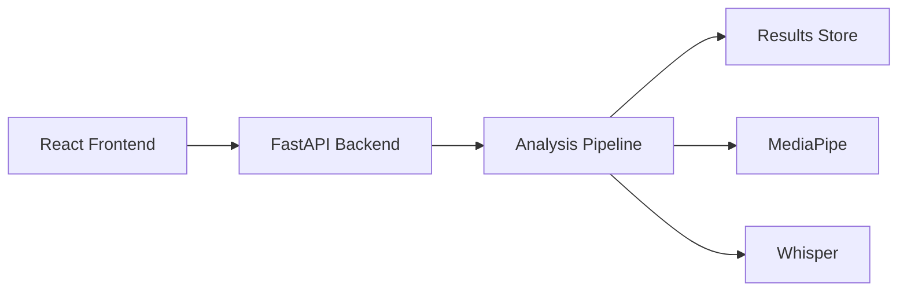

# LeetCoach
Asynchronous interview coaching that evaluates both code and communication.

Live Demo: https://leetcoach-six.vercel.app/

## Table of Contents
- What LeetCoach Does
- Why It Exists
- Key Features
- How It Works
- Tech Stack
- Getting Started (Run Locally)
- API Reference
- Evaluation and Feedback Signals
- Security and Privacy
- Project Status
- Roadmap
- Contributing
- Acknowledgements

## What LeetCoach Does
LeetCoach is a practice environment for technical interviews that goes beyond correctness. It captures how you solve problems and how you communicate while solving them.

It is designed for asynchronous use so you can practice whenever you have time, review a session later, and iterate based on clear feedback on both your solution and your delivery.

Key behaviors include:
- Reveals an interview-style prompt and starts a focused session timer
- Captures webcam and audio for communication analysis
- Accepts code uploads for review alongside the recording
- Runs an automated analysis pipeline and generates a structured report

## Why It Exists
Most interview practice tools prioritize getting the right answer. Real interviews also assess how you explain your thinking, how you handle uncertainty, and how professional your communication feels. Candidates often neglect these signals because they are hard to practice without a live interviewer. LeetCoach fills that gap with an always-available practice flow that evaluates both technical performance and communication quality.

## Key Features
- Interview-mode problem reveal with a timed session
- Webcam capture and audio recording for review
- Session recording and playback
- Code upload for analysis alongside the session
- ML-powered feedback based on video and speech signals
- Communication and professionalism signals such as clarity, pacing, and filler words

## How It Works
### Architecture Overview


### Session Data Flow
1. The user starts a new interview session in the React frontend.
2. The frontend requests a session from the FastAPI backend and receives a session ID.
3. The user records audio and video while solving the prompt and optionally uploads code.
4. The frontend uploads the media and code to the backend tied to the session ID.
5. The backend queues analysis and runs MediaPipe for visual signals and Whisper for transcription.
6. The backend aggregates metrics, generates a report, and stores results.
7. The frontend fetches the report for review and iteration.

## Tech Stack
### Frontend
- React
- JavaScript
- HTML5
- CSS
- Bootstrap

### Backend
- FastAPI
- Python

### ML and Analysis
- MediaPipe
- Whisper

## Getting Started (Run Locally)
The steps below assume a standard React plus FastAPI project layout with `/frontend` and `/backend`. If your local setup differs, adjust the paths and commands accordingly.

### Prerequisites
- Node.js 18 or later
- Python 3.10 or later
- FFmpeg on PATH for media processing
- A working webcam and microphone

### Repo Structure
```
/LeetCoach
  /frontend
  /backend
  /shared
  README.md
```

### Frontend Setup
From the project root:
```bash
cd frontend
npm install
npm run dev
```

If your frontend uses a different script name, substitute the correct command. The default here assumes Vite.

### Backend Setup
From the project root:
```bash
cd backend
python -m venv .venv
.venv\Scripts\Activate.ps1
python -m pip install --upgrade pip
pip install -r requirements.txt
uvicorn app.main:app --reload
```

If your FastAPI entrypoint differs, replace `app.main:app` with your module path. This assumes a `requirements.txt` exists in `/backend`.

### Environment Variables
Create environment files based on the following templates.

Frontend example: `frontend/.env`
```bash
VITE_API_URL=http://localhost:8000
```

Backend example: `backend/.env`
```bash
CORS_ORIGINS=http://localhost:5173
MEDIA_DIR=./data/media
RESULTS_STORE_PATH=./data/results.json
WHISPER_MODEL=base
```

If your deployment uses different ports, update the URLs accordingly.

### Troubleshooting
- CORS errors: confirm `CORS_ORIGINS` includes your frontend URL.
- Microphone permissions: allow access in your browser settings and reload the page.
- Camera permissions: verify OS permissions and test your camera in another app.
- Whisper model download: the first run may take time and requires disk space.
- MediaPipe performance: test on a machine with a discrete GPU or reduce input resolution if needed.

## API Reference
The endpoints below are representative examples based on a typical FastAPI layout.

### `POST /api/sessions/start`
Request:
```json
{
  "prompt_id": "two-sum",
  "mode": "interview"
}
```
Response:
```json
{
  "session_id": "sess_123",
  "prompt": "Return indices of two numbers that add up to target.",
  "expires_at": "2026-01-03T18:30:00Z"
}
```

### `POST /api/sessions/{session_id}/code`
Request:
```json
{
  "language": "python",
  "filename": "solution.py",
  "code": "def two_sum(nums, target): ..."
}
```
Response:
```json
{
  "status": "uploaded",
  "session_id": "sess_123"
}
```

### `POST /api/sessions/{session_id}/media`
Request:
```json
{
  "media_type": "video",
  "filename": "session.mp4",
  "content_base64": "..."
}
```
Response:
```json
{
  "status": "uploaded",
  "duration_seconds": 842
}
```

### `POST /api/sessions/{session_id}/analyze`
Request:
```json
{
  "run_whisper": true,
  "run_mediapipe": true
}
```
Response:
```json
{
  "status": "queued",
  "analysis_id": "analysis_456"
}
```

### `GET /api/sessions/{session_id}/report`
Response:
```json
{
  "session_id": "sess_123",
  "technical": {
    "correctness": "pass",
    "time_to_first_working_solution_sec": 620,
    "efficiency": "O(n)",
    "test_pass_rate": 1.0
  },
  "communication": {
    "clarity_score": 0.82,
    "filler_words_per_min": 3.1,
    "pacing_wpm": 138,
    "professionalism_notes": ["clear structure", "steady pace"]
  }
}
```

## Evaluation and Feedback Signals
LeetCoach provides feedback based on observable session data and derived signals. It does not make medical or sensitive claims.

Technical metrics:
- Correctness based on tests or reference checks, if available
- Time to first working solution
- Efficiency and complexity heuristics
- Test pass rate when a test suite exists

Communication signals:
- Clarity and conciseness based on transcript structure
- Filler word frequency and pacing from audio
- Confidence proxies such as pauses and restarts
- Professionalism cues based on phrasing and organization

Measured vs inferred:
- Measured: timing, transcript length, filler counts, pacing
- Inferred: clarity score, professionalism notes based on patterns

## Security and Privacy
- Recordings are processed to generate feedback signals and a session report.
- Stored artifacts may include uploaded code, transcript text, and derived metrics.
- Media retention policies are planned. A delete endpoint is expected in a future release.
- For local development, files are stored on the machine running the backend.

## Project Status
LeetCoach is a working prototype with ongoing development, active iteration on analysis quality, and a focus on reliability.

## Roadmap
- Expand prompt library and interview modes
- Improve feedback fidelity and explainability
- Add secure, user-managed session deletion
- Support team and mock interview workflows

## Contributing
Contributions are welcome. If you plan a significant change, open an issue first to align on scope.

Steps:
1. Fork the repo and create a feature branch.
2. Make changes with clear commit messages.
3. Add or update tests if behavior changes.
4. Open a pull request with a focused description and screenshots if UI changes.
